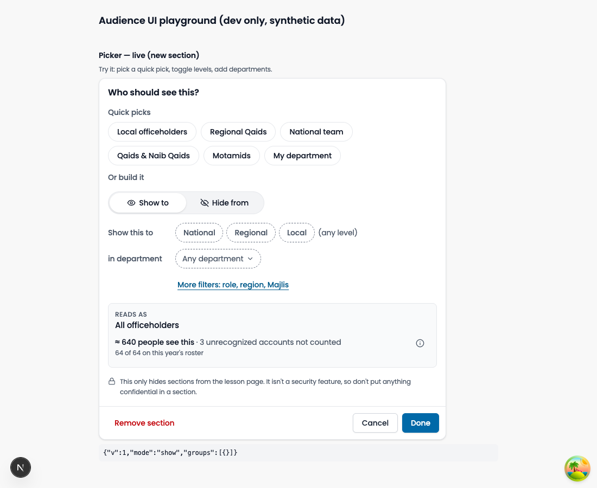
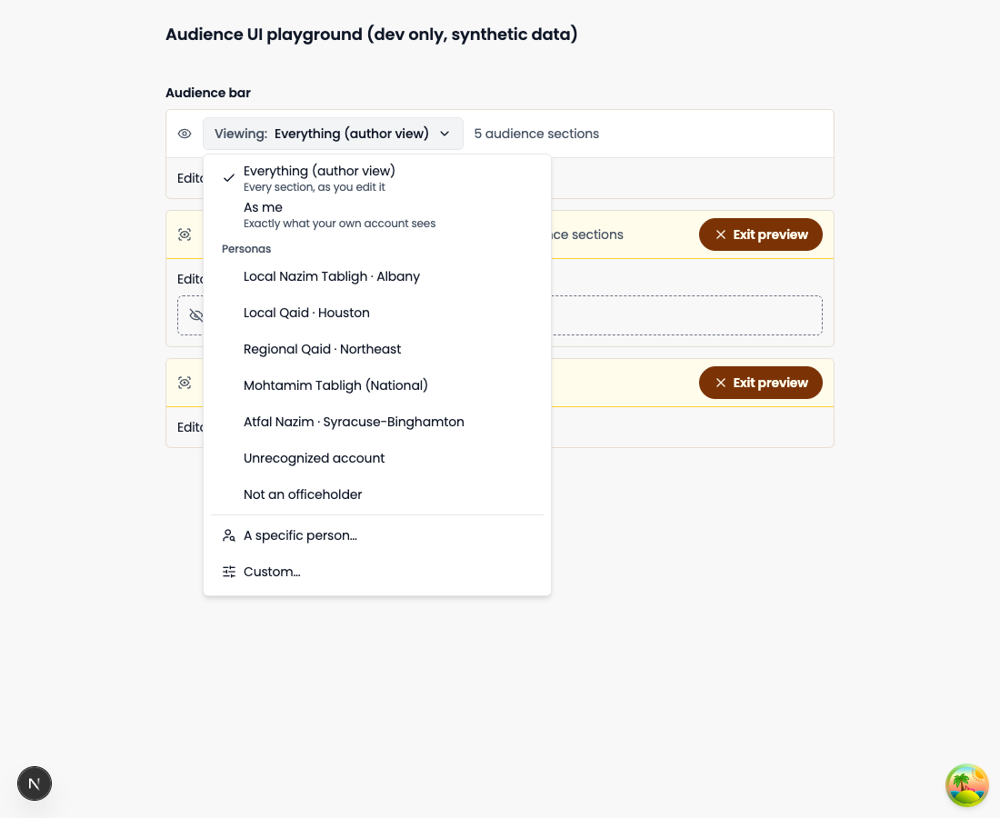

# Showing lesson sections to the right officeholders

A guide for Mohtamims and anyone who writes lessons.

## What an audience section is

An audience section is a group of blocks in a lesson that only some people see. For example, instructions for local Nazims can sit in the same lesson as instructions for regional Qaids, and each person sees only theirs.

> **This is a convenience, not secrecy.** Audience sections tidy up a lesson. They do not protect it. Never put anything confidential in a section.

## Add one

- Type `/audience` on an empty line and choose **Audience section**, or
- Select the blocks you want to wrap and press **Ctrl+Alt+A** (Windows) or **Cmd+Alt+A** (Mac).

The picker opens right away. Sections cannot sit inside other sections.

<!-- TODO screenshot: integration-slash-menu-audience -->

## The picker

- **Quick picks** fill in the common choices with one tap: Local officeholders, Regional Qaids, National team, Qaids & Naib Qaids, Motamids, and My department.
- **Show to / Hide from** decides whether the people you choose see the section or are the only ones who don't.
- **Level and department** narrow it down. Tap the level chips (National, Regional, Local) and add departments with the search box. Choices in the same row mean "or". Different rows mean "and".
- **More filters** adds role, region and Majlis.

Press **Done** when you finish. **Remove section** takes the wrapper off and keeps your blocks.

## "Reads as" and the people count

"Reads as" repeats your choices in plain English, such as "Local officeholders in Tabligh". If it doesn't say what you meant, change the picker.

Under it you'll see a count like "≈ 62 people see this". On some courses a second line shows how many of this year's roster that is, for example "62 of 64 on this year's roster".

The count can be lower than you expect early on. It only includes people whose accounts the system has matched to an officeholder role, and many people haven't signed in yet. The count tells you how many unrecognized accounts it left out. Tap the (i) next to it for details.

## Preview as…

Use the **Viewing** bar at the top of the editor to see the lesson through someone else's eyes.

- **Everything (author view)** is the normal editing view.
- **As me** shows what your own account sees.
- **Personas** are sample viewers, such as a local Nazim Tabligh in Albany.
- **A specific person…** (admins only) shows exactly what that person sees. This is recorded in the audit log.
- **Custom…** lets you build a viewer from level, department, role and Majlis.

While you preview, the bar turns yellow. Sections the viewer can't see show as a dashed box. Press **Exit preview** to return.

<!-- TODO screenshot: integration-preview-as-in-editor -->

## What learners see

- Only their own sections. Other sections are not on the page at all.
- Inline fields. Typing `{{my_majlis}}` shows each learner their own Majlis. Region, department and role work the same way.
- A **My counterparts** card, if you add one, showing the people they work with.
- A note, if we couldn't recognize their role, saying some content may be hidden.
- A card saying nothing in the lesson is meant for them, when every part of it is hidden.

## Five recipes

**1. Show only to my department**
1. Add a section around the blocks.
2. Tap **My department** under Quick picks.
3. Check "Reads as", then press **Done**.

**2. Different wording for local and regional officeholders**
1. Write the local version and wrap it in a section. Tap **Local** under Show to.
2. Write the regional version and wrap it in a second section. Tap **Regional**.
3. Preview as a Local persona and a Regional persona to check each one.

**3. Hide from Atfal officeholders**
1. Add the section and switch to **Hide from**.
2. Under "in department", add **Atfal**.
3. "Reads as" should say "Everyone except officeholders in Atfal". Press **Done**.

Note: people we can't recognize also see hide-sections, because we don't know they are in Atfal.

**4. Only Qaids and Naib Qaids**
1. Add the section and tap **Qaids & Naib Qaids** under Quick picks.
2. Press **Done**.

**5. One Majlis, or a whole region**
1. Add the section and tap **More filters**.
2. Under "in Majlis", search for the Majlis and pick it.
3. For a whole region, open the same list and choose **Select whole … region** under that region's heading. It moves to the "in region" row.

## Troubleshooting

- **"Nobody currently matches this."** Your choices don't fit anyone. Remove a filter, or check that the department and role are right.
- **A red "Unknown: …" chip.** The picker doesn't know that value, often because a department was renamed. Press **Replace** on the chip and choose the current name.
- **"Made with a newer editor."** Someone used a newer version of the editor. You can look at the section but not change it. Learners won't see it until the editor is updated. Ask an admin.
- **Someone says they can't see a section.** First look at their role. If our system doesn't recognize them, no "Show to" section will reach them. Ask an admin to check their role. Then use **A specific person…** to preview what they see.
